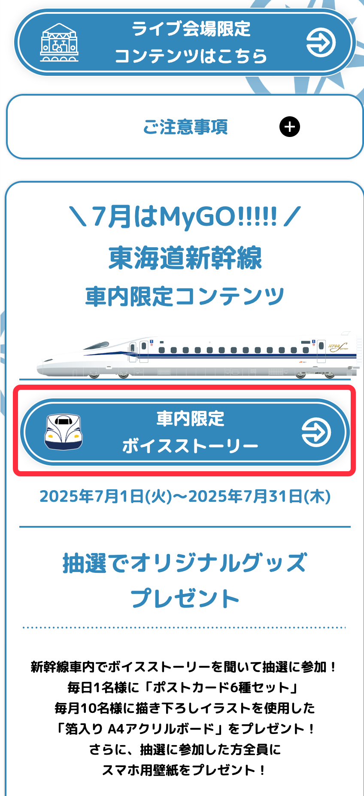
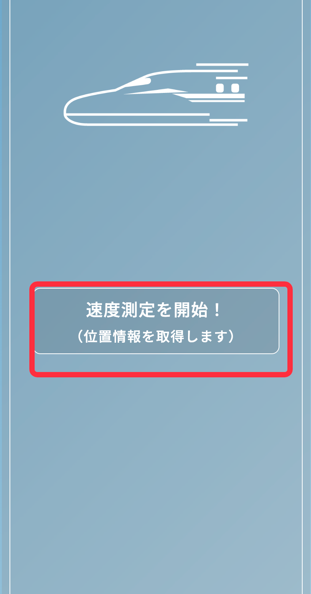
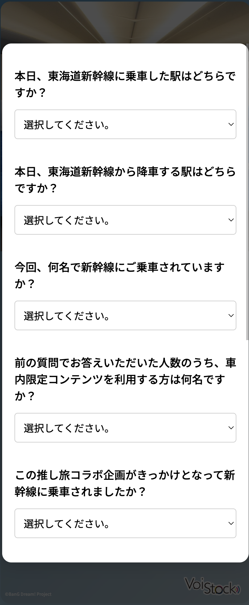
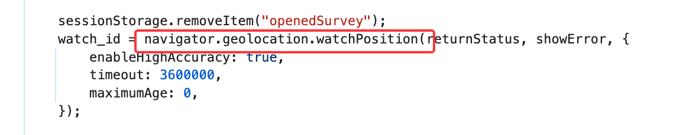
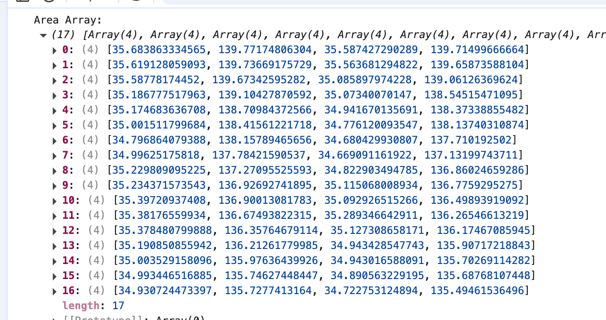

# fuck-jr-central-oshi-tabi-speedtest 去他妈的JR东日本 "推し旅" 测速
## 简介
众所周知，JR东日本经常推出和一些热门IP和新干线联动的 "推し旅"  
这些活动往往需要乘坐新干线进行测速来领取特典，比如 [JR東海×「BanG Dream! 10th ANNIVERSARY」](https://recommend.jr-central.co.jp/oshi-tabi/bang-dream-10th/)  
本脚本就是用来快速绕过这个测速的
## 使用说明
1. (如果有请跳过) 确保你的浏览器支持用户脚本，Chrome/Edge需要安装 -> [tampermonkey](https://www.tampermonkey.net/)，iOS -> [Userscripts](https://apps.apple.com/cn/app/userscripts/id1463298887)，Android -> [x浏览器](https://www.xbext.com/index.html)
2. [点击这里](https://raw.githubusercontent.com/kiritoxkiriko/fuck-jr-central-oshi-tabi-speedtest/refs/heads/main/script.user.js) 安装脚本  
3. 打开一个活动页面，以 https://recommend.jr-central.co.jp/oshi-tabi/bang-dream-10th/ 为例  
    
4. 点击车内限定按钮后进入测速界面  
   
5. 测速开始后会直接跳转到完成后的问卷页面，完成即可领取特典  
   

## 原理
F12 进入 devtools发现是在前端通过调用浏览器的 navigator API 来判断速度  
  
同时还会判断当前经纬度是否在一组范围中，搞笑的是前端直接在 console 帮我们把 array打印出来了 
  

我们只需要hook浏览器的 navigator.geolocation.watchPosition，让他返回一个固定的速度，和一个在范围内的随机经纬度即可

